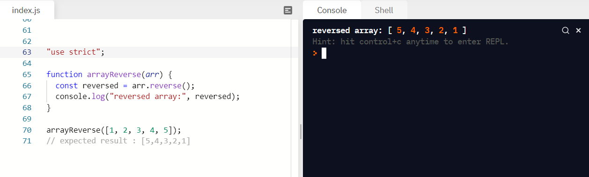
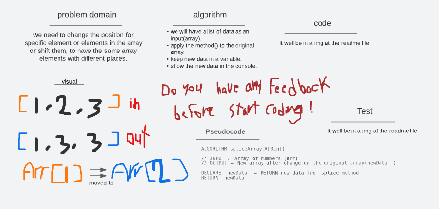
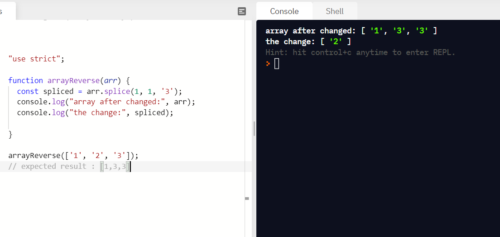

# 401 code

# Code Challenges

  

# Reverse an Array 01

- The challenge is to reverse the contents of the array.
- Using the whiteboard to _plan_ work before started.
- Wright _Problem Domain_, _Visual_, _Algorithm_, _Pseudocode_.
- Then start _codeing_
- _Test_ the code.
- I take some time and faced problems because I am not familiar with using the whiteboard yet.

 

- the _img_ for the code and the test is below

## Whiteboard Process

## code and the testing

<!-- //////////////////////////////////////////////////////////////////////////////////////////// -->

  

# Insert and shift an array 02

- The challenge is to edit and change the places of the array elements.
- Using the whiteboard to planing before work.
- Wright _Problem Domain_, _Visual_, _Algorithm_, _Pseudocode_.
- used Array.splice() method to apply the changes on the array.
- _Test_, I test the code in replit to check the result.

 

- this assignment took 60 min .

* the _img_ for the code and the test is below:

## Whiteboard Process

## code and the testing

<!-- //////////////////////////////////////////////////////////////////////////////////////////// -->

  

