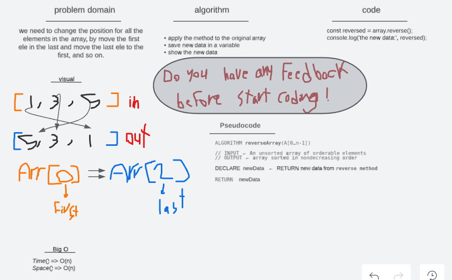
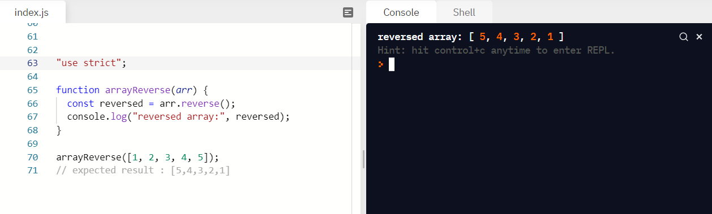

# Data Structures and Algorithms

# 401 code

# Code Challenges

# Reverse an Array 01

- The challenge is to reverse the contents of the array.
- Using the whiteboard to _plan_ work before started.
- Wright _Problem Domain_, _Visual_, _Algorithm_, _Pseudocode_.
- Then start _codeing_
- _Test_ the code.
- I take some time and faced problems because I am not familiar with using the whiteboard yet.

* the _img_ for the code and the test is below

## Whiteboard Process

## code and the testing

<!-- //////////////////////////////////////////////////////////////////////////////////////////// -->
